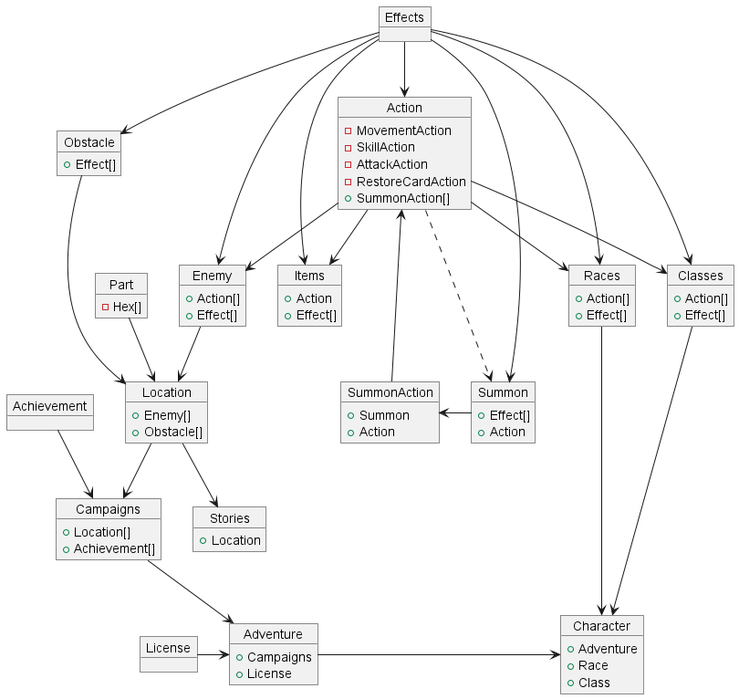

# TTS-Database

This repo contains scripts for managing (creating, dropping and filling) the main TTS testing database.

## Setup
- Make sure you have your virtual environment set up properly
  - `python3 -m venv .venv`
  - `source .venv/bin/activate`
- Make sure all requirements are installed
  - `pip install -r requirements.txt`
- Create .env file
  - `cp .env.example .env`
  - update .env file with your credentials
 
## Run
The database is equipped with the following scripts, located in the `script` folder:
- `create.py`: creates the database and fills it with testing data
  - `-s` flag skips the insert phase
- `drop.py`: drops the entire database
- `insert.py`: clears and re-inserts testing data into the database
  - `-s` flag skips the clear phase

## Development
- If you want to make changes, please test them in the development database
  - To do so, simply change the `DB_NAME` in the `.env` file to the dev database name

Run these scripts with a command such as `python3 script/create.py`.

## Schema
The database diagram can be found here: [full](https://dbdiagram.io/d/CommunistBachelor-652c00e7ffbf5169f0b71ee4), [readonly](https://dbdiagram.io/d/TTS-Game-Database-652c00e7ffbf5169f0b71ee4).

When the diagram is updated, just export it into MySql and copy the contents into `manage/create.sql` and update the inserting scripts to go with your changes.

## Insert Priority Graph
This graphs shows what table is required in witch table.

By traversing the graph from source to most distant node, we can determine the order in which the tables should be inserted.
*Dashed lines* represents a split creation due to cyclic dependencies.

  

